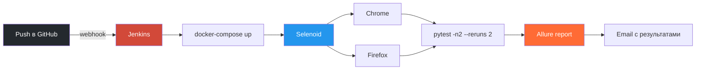
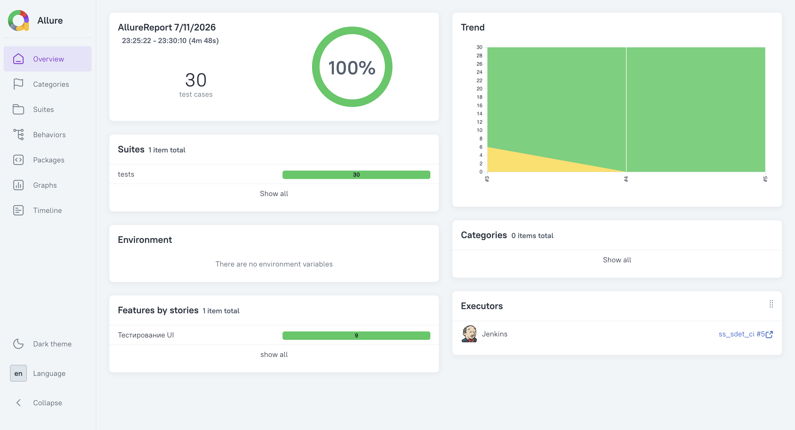
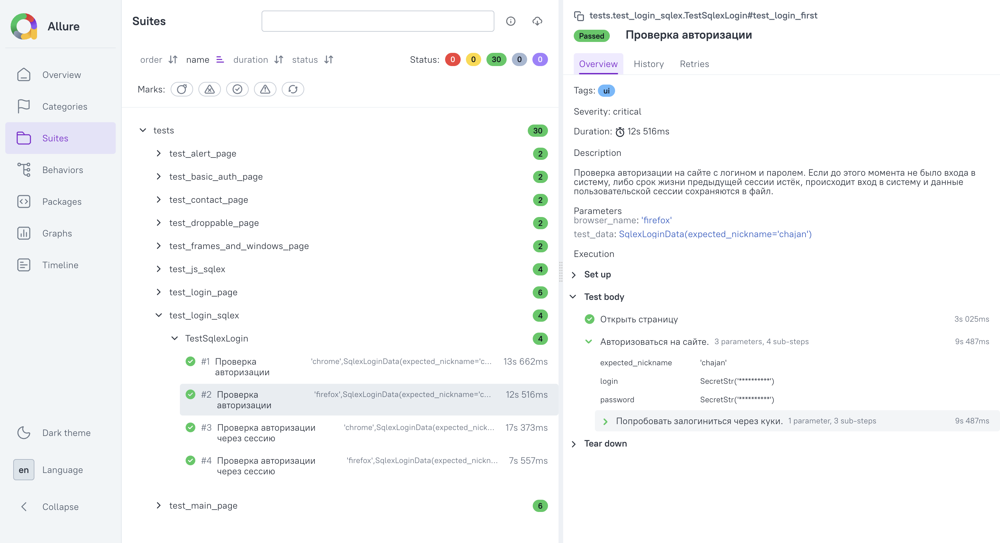

# UI Test Automation Framework


UI-автотесты для [way2automation.com](https://www.way2automation.com/) на Selenium + pytest, построенные по паттерну Page Object Model, с кросс-браузерным запуском через Selenoid и полным CI/CD-пайплайном на Jenkins от пуша в GitHub до отчёта на почте.

Проект охватывает весь блок "UI autotests" (задачи UI0-UI13): от базового POM-проекта и Allure-отчётности до параллельного запуска, работы с куками, JavaScriptExecutor, drag-n-drop, вкладок, алертов и basic auth. Изначальные локаторы и POM адаптированы под изменившуюся вёрстку сайта. Список автоматизированных задач с привязкой к коду - в [docs/task-coverage.md](docs/task-coverage.md).

Проект выполнен в рамках внешней стажировки SimbirSoft под руководством ментора.

## Оглавление

- [Ключевые особенности](#ключевые-особенности)
- [Технологии](#технологии)
- [Структура проекта](#структура-проекта)
- [Настройка окружения](#настройка-окружения)
- [Запуск тестов](#запуск-тестов)
- [CI/CD](#cicd)
- [Allure-отчёт](#allure-отчёт)
- [Архитектурные решения](#архитектурные-решения)

## Ключевые особенности

- **Page Object Model с единым контрактом**: методы-действия кидают исключение при неудаче, методы-проверки возвращают `bool`, ассерты вынесены из POM в тесты
- **Кросс-браузерность**: Chrome + Firefox через Selenoid, параметризация прогона по браузерам
- **CI/CD на Jenkins**: автозапуск по пушу в GitHub, параллельный прогон, Allure-отчёт и email-уведомление без ручного вмешательства
- **Стабильность прогонов**: soft-ассерты (несколько проверок за один тест), ретраи флаки-тестов, скриншот при падении
- **Защита секретов**: типизированный конфиг (`pydantic-settings`), креды через `SecretStr` и Jenkins Credentials - не хранятся в репозитории и не светятся в отчётах

## Технологии

| Компонент                     | Версия         | Назначение                          |
|--------------------------------|----------------|--------------------------------------|
| Python                         | 3.10           | Базовый язык проекта                 |
| Selenium WebDriver             | 4.41+          | Взаимодействие с браузером           |
| pytest                         | 9.0+           | Фреймворк тестирования               |
| pytest-xdist                   | 3.8+           | Параллельный запуск                  |
| pytest-rerunfailures           | 16.1+          | Автоповтор упавших тестов            |
| allure-pytest                  | 2.15+          | Интеграция с Allure                  |
| pydantic / pydantic-settings   | 2.13+ / 2.14+  | Типизированный конфиг, `SecretStr`   |
| Docker + Selenoid              | -              | Кросс-браузерный грид для CI         |
| Jenkins                        | -              | Оркестрация CI/CD-пайплайна          |

## Структура проекта

```
ss_sdet_ui/
├── config/                    # Настройки, урлы, фабрика драйверов
│   ├── settings.py            # pydantic-settings, SecretStr для кредов
│   ├── drivers.py             # Фабрика WebDriver (локально / Grid)
│   ├── browser_options.py     # Опции браузеров
│   └── pages_urls.py          # URL тестируемых страниц
├── locators/                  # Локаторы элементов по страницам
├── pages/                     # Page Object'ы
│   ├── base_page.py           
│   └── ...
├── tests/                     # Тестовые сценарии
│   └── conftest.py            # driver, open_page, скриншот при падении
├── test_data/                 # Тестовые данные (датаклассы + наборы данных)
├── utils/                     # batch_assert, cookie_tools, string_builders и др.
├── selenoid/                  # Конфиг Selenoid для CI (browsers.json)
├── bash_scripts/              # Скрипты запуска (Grid и Selenoid)
├── docs/                      # Документация (покрытие задач, архитектура)
├── Dockerfile
├── docker-compose.yml         # Сервисы selenoid + tests
├── Jenkinsfile                # CI-пайплайн
├── pytest.ini
└── requirements.txt
```

## Настройка окружения

**1. Клонировать репозиторий**
```bash
git clone https://github.com/chajancode/ss_sdet_ui.git
cd ss_sdet_ui
```

**2. Создать и активировать виртуальное окружение**
```bash
python -m venv venv
source venv/bin/activate      # Linux/macOS
venv\Scripts\activate         # Windows
```

**3. Установить зависимости**
```bash
pip install -r requirements.txt
```

**4. Создать файл `.env` в корне проекта** (нужен для тестов авторизации на sql-ex.ru)
```
LOGIN=<логин от sql-ex.ru>
PASSWORD=<пароль от sql-ex.ru>
```

## Запуск тестов

Тесты запускаются через pytest. Самый простой запуск - локально в Chrome:
```bash
pytest
```

Поведение прогона настраивается флагами pytest (объявлены в [`conftest.py`](tests/conftest.py)):

| Флаг pytest | Значения                              | Описание                            |
|-------------|----------------------------------------|--------------------------------------|
| `--grid`    | флаг                                    | Запуск через Selenium Grid/Selenoid  |
| `--browser` | `chrome`, `firefox`, `chrome,firefox`   | Браузер(ы) для прогона               |
| `-n`        | число                                   | Количество параллельных воркеров     |
| `--reruns`  | число                                   | Автоповтор упавших тестов            |

Пример с флагами (параллельно, оба браузера, 2 повтора при падении):
```bash
pytest --grid --browser chrome,firefox -n 2 --reruns 2
```

**Локально через Selenium Grid** (готовые скрипты):
```bash
bash bash_scripts/grid_start.sh          # поднять грид
bash bash_scripts/grid_run_tests.sh      # прогнать тесты
bash bash_scripts/grid_stop.sh           # остановить грид
```

**В Docker (как в CI), через Selenoid:**
```bash
docker-compose up --build
```

**Пример реального прогона** (из CI, кросс-браузерно):
```
============================= test session starts ==============================
platform linux -- Python 3.10.20, pytest-9.0.2, pluggy-1.6.0
rootdir: /app
configfile: pytest.ini
testpaths: tests/
plugins: xdist-3.8.0, rerunfailures-16.1, allure-pytest-2.15.3
created: 2/2 workers
2 workers [30 items]

......................R.R.......                                         [100%]
=================== 30 passed, 2 rerun in 328.88s (0:05:28) ====================
```

## CI/CD



Учётные данные передаются через Jenkins Credentials и не хранятся в репозитории. Автозапуск - по пушу в ветку через GitHub webhook.

## Allure-отчёт

```bash
allure generate allure-results -o allure-report --clean
allure open allure-report
```

Сводка по прогону (30 тестов, кросс-браузерно, запуск из Jenkins):



Детализация теста с Allure-степами. Креды обёрнуты как `SecretStr('**********')` - секреты не попадают в отчёт:



## Архитектурные решения

Обоснование ключевых решений (POM, защита секретов, разбор найденной утечки кредов в Allure, тюнинг конкурентности CI) - в [docs/ARCHITECTURE.md](docs/ARCHITECTURE.md).
